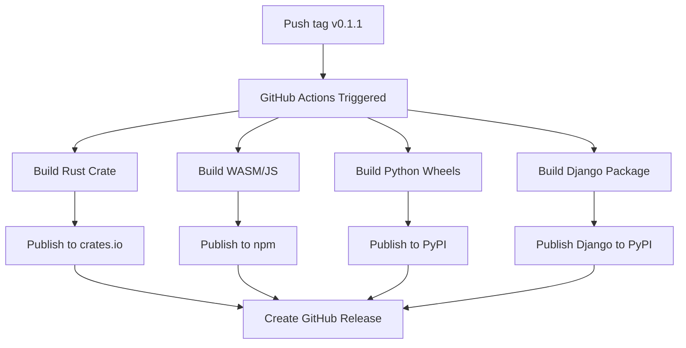

# 🚀 Quick Release Guide

## Prerequisites (One-Time Setup)

### Add GitHub Secrets

Go to: `https://github.com/4mritgiri/npdatetime-rust/settings/secrets/actions`

Add these 3 secrets:

| Secret Name | Where to Get It | Purpose |
|-------------|-----------------|---------|
| `CARGO_TOKEN` | https://crates.io/me → New Token | Publish to crates.io |
| `NPM_TOKEN` | https://npmjs.com/settings/4mritgiri/tokens | Publish to npm |
| `PYPI_TOKEN` | https://pypi.org/manage/account/token/ | Publish to PyPI |

## Publishing a New Version (Every Release)

### Step 1: Update Version

```bash
# Use the version update script
python3 update_version.py 0.1.1

# This updates version in ALL packages automatically:
# - Cargo.toml
# - bindings/python/Cargo.toml & pyproject.toml
# - bindings/javascript/package.json
# - bindings/django/setup.py, pyproject.toml, __init__.py
```

### Step 2: Update Changelogs

```bash
# Update main CHANGELOG.md
vim CHANGELOG.md

# Update Django CHANGELOG.md
vim bindings/django/CHANGELOG.md
```

### Step 3: Build Django Assets

```bash
cd bindings/django
python3 build_assets.py
cd ../..
```

### Step 4: Test Locally (Optional but Recommended)

```bash
# Test Rust
cargo test --all-features

# Test Python
cd bindings/python && maturin develop && pytest

# Test Django
cd bindings/django && pip install -e . && python -c "import npdatetime_django"
```

### Step 5: Commit, Tag, and Push

```bash
# Commit changes
git add .
git commit -m "chore: release version 0.1.1"

# Create tag
git tag v0.1.1

# Push everything
git push origin main
git push origin v0.1.1
```

### Step 6: Watch the Magic! ✨

GitHub Actions will automatically:
1. ✅ Build and test everything
2. ✅ Publish to crates.io
3. ✅ Publish to npm
4. ✅ Publish to PyPI (Python package)
5. ✅ Publish to PyPI (Django package)
6. ✅ Create GitHub Release

Monitor at: `https://github.com/4mritgiri/npdatetime-rust/actions`

## Quick Commands Reference

```bash
# Update version across all packages
python3 update_version.py 0.1.1

# Build Django assets
cd bindings/django && python3 build_assets.py

# Test everything locally
cargo test --all-features

# Create and push release
git add . && git commit -m "chore: release v0.1.1"
git tag v0.1.1
git push && git push --tags

# Check published packages
open https://crates.io/crates/npdatetime
open https://pypi.org/project/npdatetime
open https://pypi.org/project/django-npdatetime
open https://npmjs.com/package/@4mritgiri/npdatetime
```

## Troubleshooting

**Q: Workflow failed with authentication error**
→ Check that you've added all three secrets correctly

**Q: Package already published error**
→ This is normal if version hasn't changed. Workflow continues anyway.

**Q: Django package fails to build**
→ Make sure you ran `cd bindings/django && python3 build_assets.py`

**Q: Want to test without publishing?**
→ Create a branch and push there. Only tags trigger publishing.

## What Happens When You Push a Tag



## Full Documentation

- [CI/CD Setup Guide](.github/CICD_SETUP.md) - Complete setup instructions
- [Publish Workflow](.github/workflows/publish.yml) - Publishing automation
- [CI Workflow](.github/workflows/ci.yml) - Testing automation
- [Bindings Tests](.github/workflows/test-bindings.yml) - Python/Django tests

---

That's it! Simple 6-step process to release everything at once! 🎉
